## Insights Summary with Visualizations

This section summarizes the key findings from the analysis with corresponding charts.

---

### 1. Sales Analysis

#### 🔹 Top Best-Selling Games (Region)
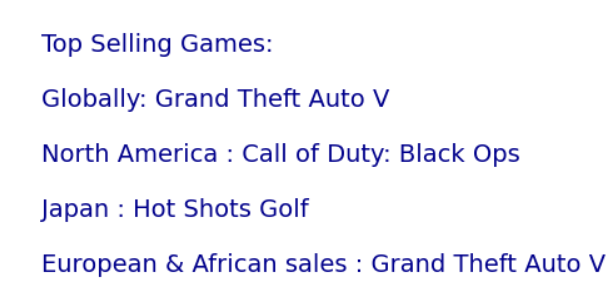

#### 🔹 Regional Sales Comparison
Bar chart comparing average sales across regions.
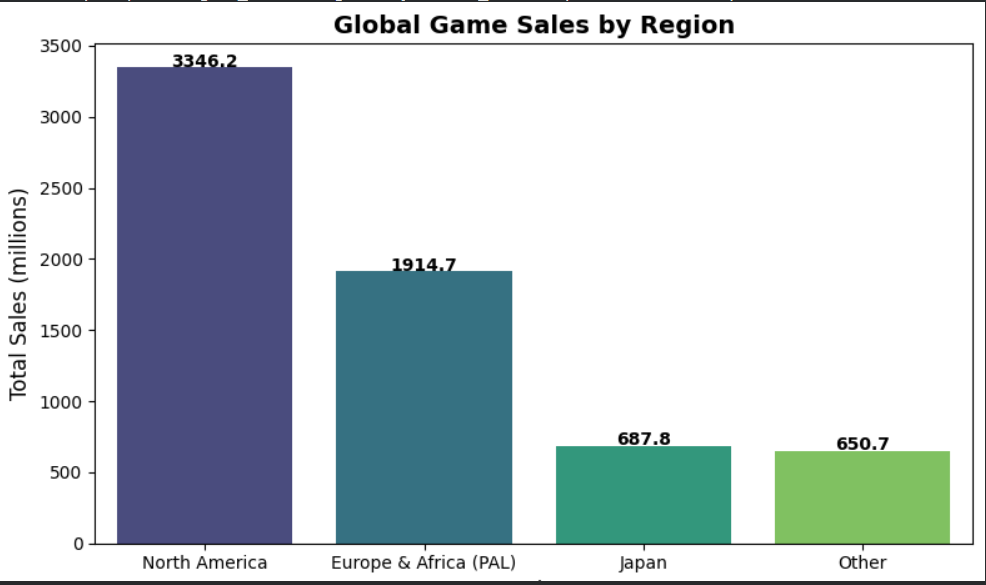

#### 🔹 Genre Popularity
Top-performing genres globally.
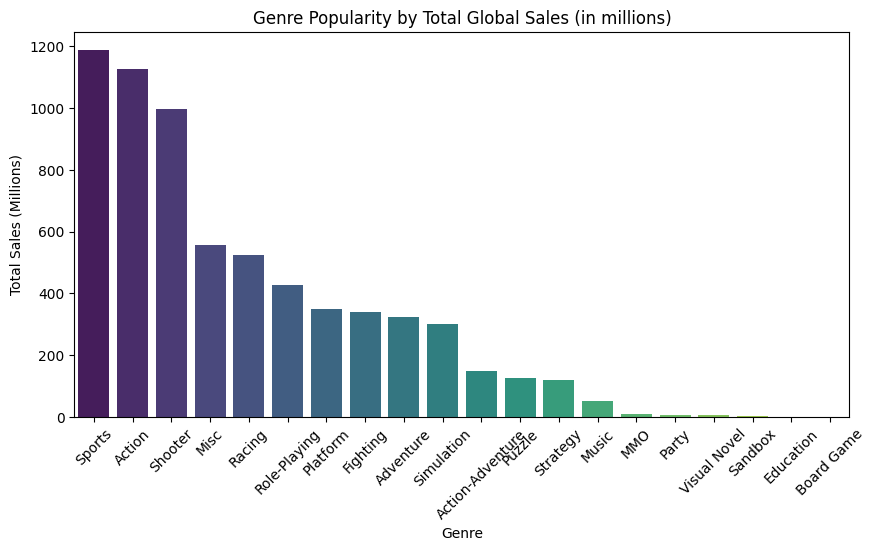

#### 🔹 Japanese vs. North American Sales (Top Games)
Comparison of regional sales.
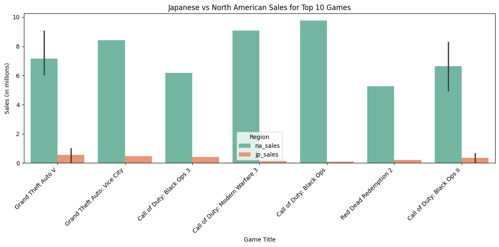

---

### 2. Critic Score Impact

#### 🔹 Correlation: Critic Score vs. Total Sales
Visualizing relationship strength between critic ratings and sales.
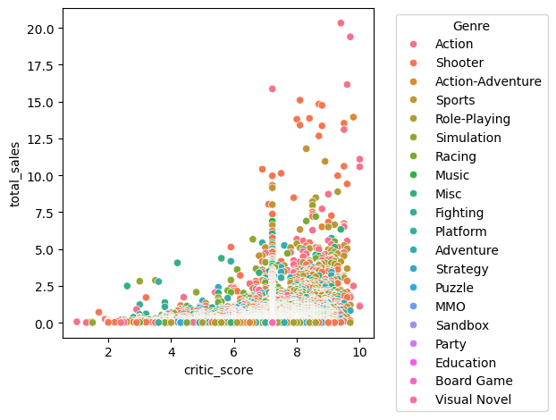

#### 🔹 Top Publishers by Average Critic Score
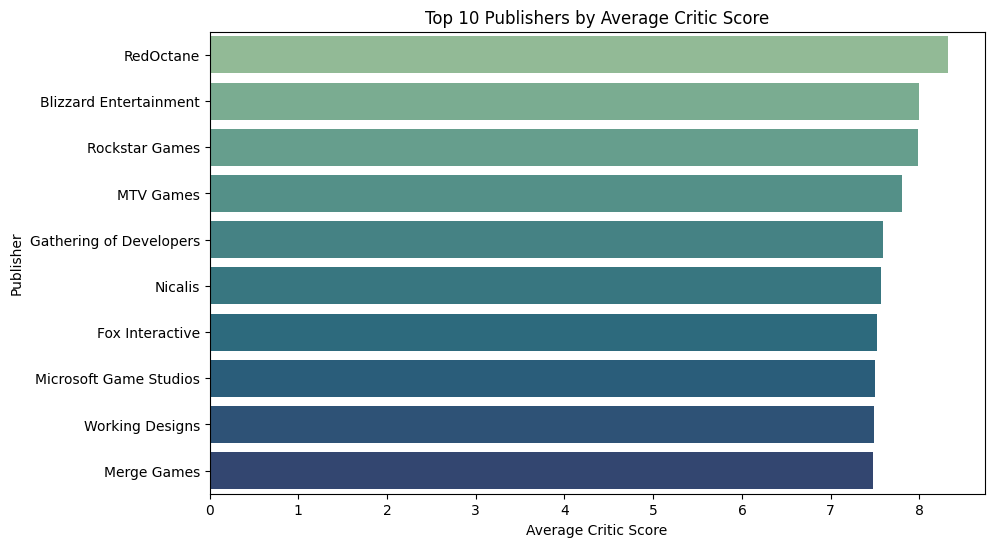

---

### 3. Time-Based Trends

#### 🔹 Yearly Global Sales Trend (2000–2024)
Identifying peak years and blockbuster trends.
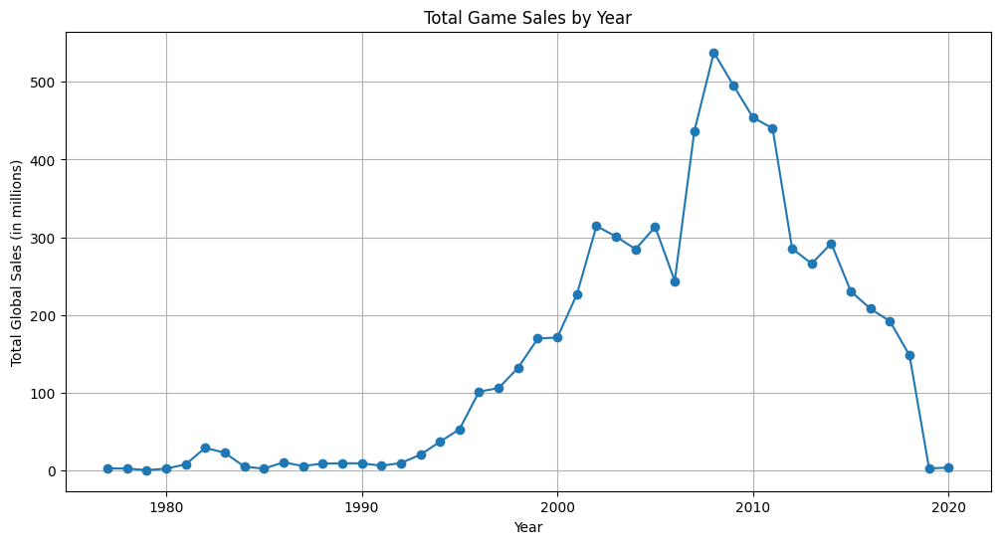

#### 🔹 Regional Sales by Year
Shows how each region’s market evolved over time.
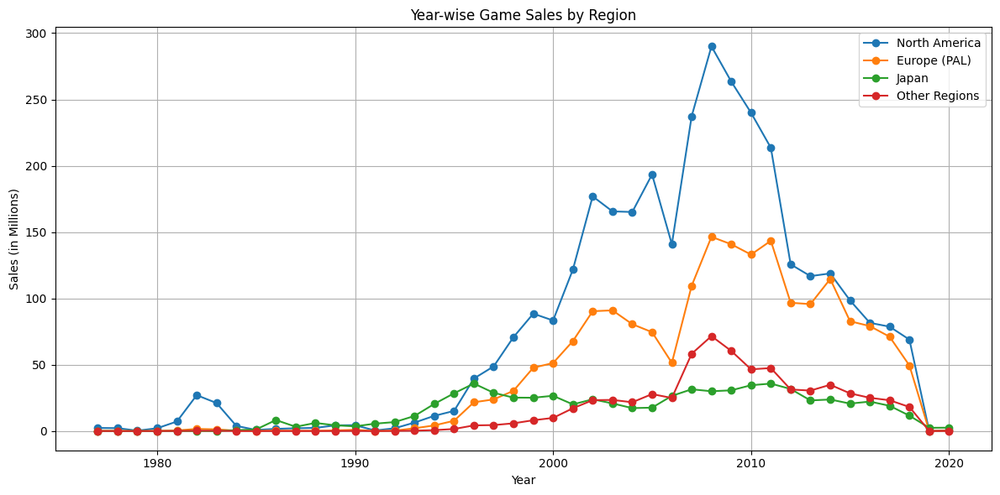

---

### 4. Regional Insights

#### 🔹 Genre Preferences by Region
Understanding different gaming tastes.
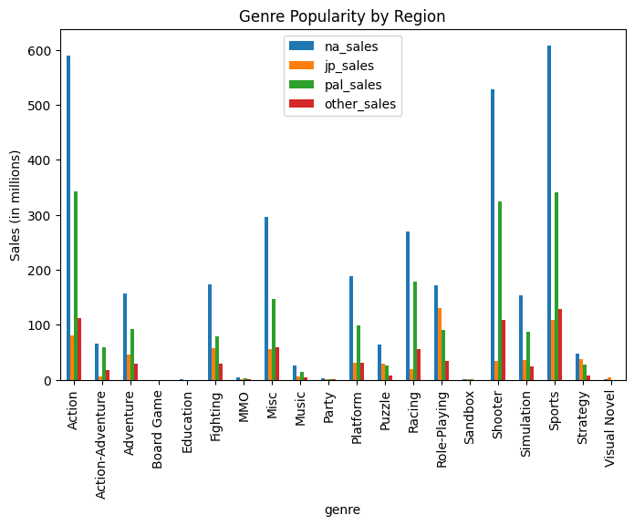

#### 🔹 Top Publishers in Each Region
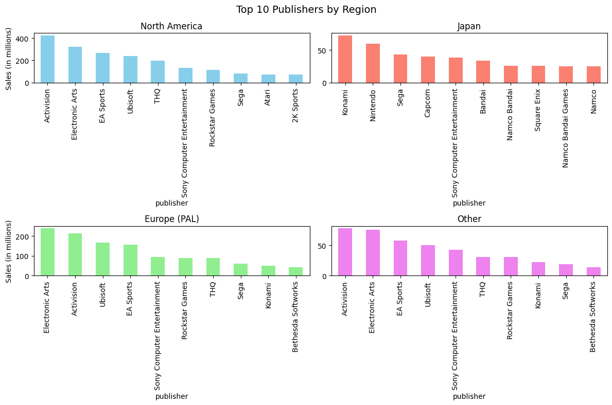

---

### 5. Publisher / Developer Performance

#### 🔹 Average Sales per Publisher
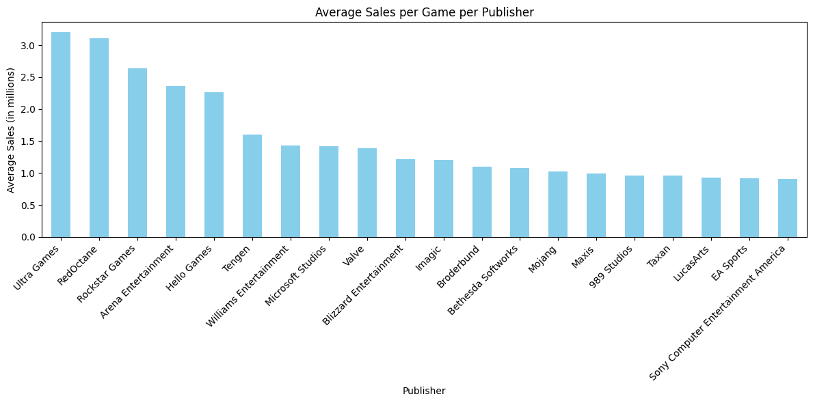

#### 🔹 Developer vs. Average Critic Score
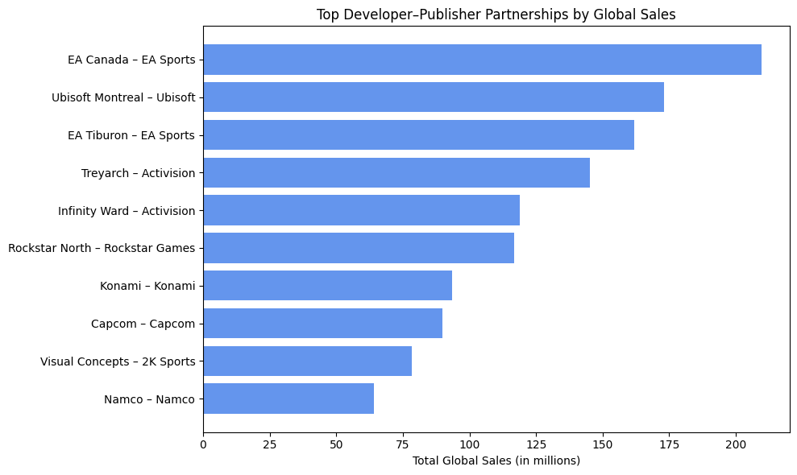

---

### 6. Platform Evolution

#### 🔹 Top 10 Multi-Platform Sales Comparison
Compare how the same title performed on different consoles.
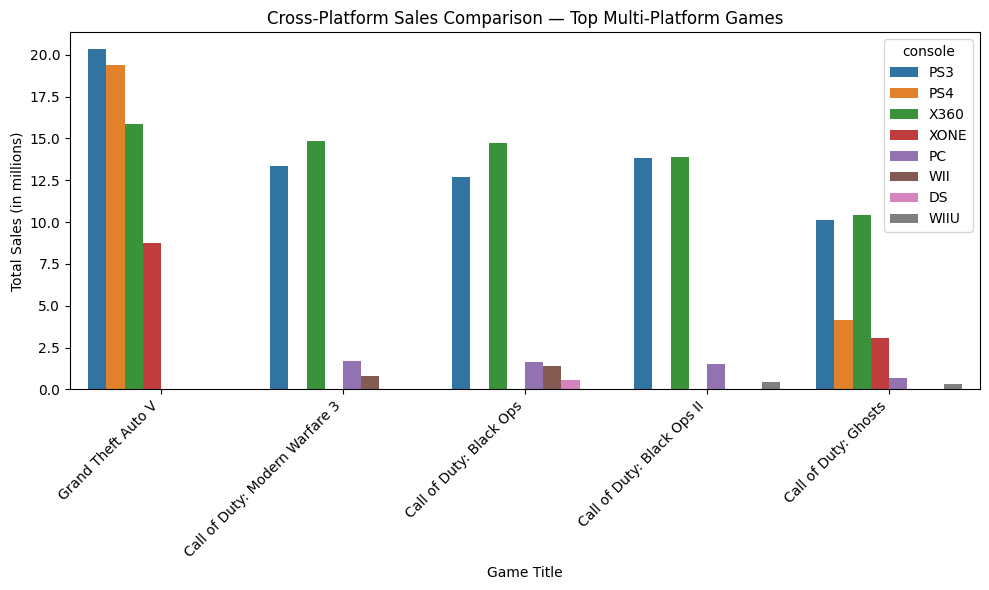

#### 🔹 Console Lifecycle Trends
Which platforms dominated each era.
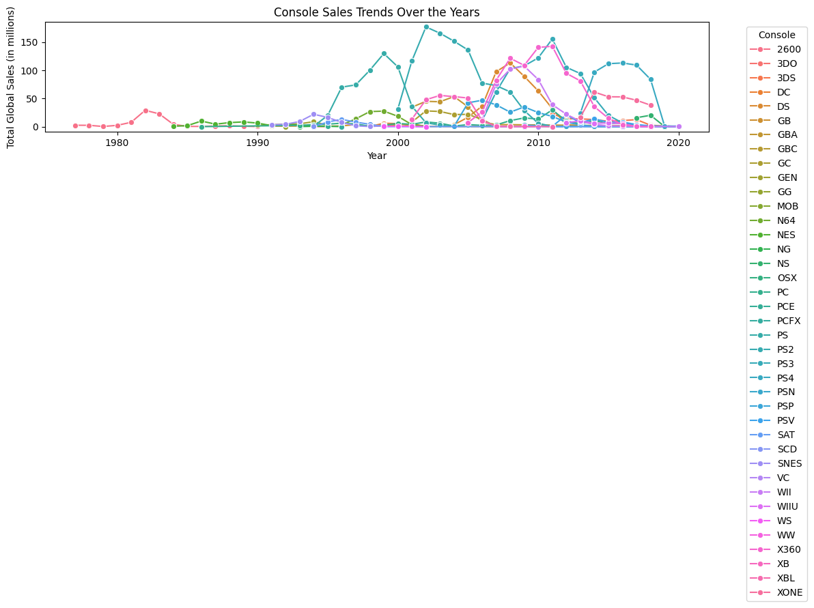

#### 🔹 Correlation Heatmap: Sales and Critic Score by Region
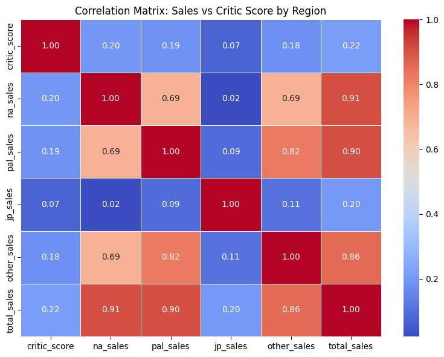

